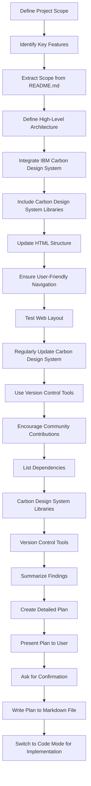

# vsskin Project Plan

## Project Scope

- Browse a wide selection of professionally designed themes based on popular tech brands.
- Preview themes in real-time to see how they will look in the development environment.
- Install themes with a single click for easy customization of VS Code setups.
- Save favorite themes for quick access and switching between different themes.
- Share themes with other developers for collaboration and community-driven theme development.
- Access detailed information about each theme, including color palettes and brand guidelines.
- Support for both light and dark themes to cater to different user preferences.
- Regular updates with new themes and improvements to existing themes.
- A user-friendly interface for easy navigation and finding perfect themes.
- Compatibility with various versions of VS Code.

## High-Level Architecture

1. Including Carbon Design System CSS and JavaScript files.
2. Updating HTML structure to use Carbon Design System components and classes.
3. Ensuring user-friendly navigation and accessibility.
4. Testing the web layout for responsiveness and usability.
5. Regularly updating Carbon Design System components and styles.
6. Using version control systems like Git for managing changes.
7. Encouraging community contributions and feedback for improvements.

## Dependencies

- **Carbon Design System Libraries**: Required for implementing the web layout UI.
- **Version Control Tools**: Such as Git for managing theme updates and changes.

## Detailed Plan

## Project Scope and Key Features

- Browse a wide selection of professionally designed themes based on popular tech brands.
- Preview themes in real-time to see how they will look in the development environment.
- Install themes with a single click for easy customization of VS Code setups.
- Save favorite themes for quick access and switching between different themes.
- Share themes with other developers for collaboration and community-driven theme development.
- Access detailed information about each theme, including color palettes and brand guidelines.
- Support for both light and dark themes to cater to different user preferences.
- Regular updates with new themes and improvements to existing themes.
- A user-friendly interface for easy navigation and finding perfect themes.
- Compatibility with various versions of VS Code.

## High-Level Architectural Plan

1. Including Carbon Design System CSS and JavaScript files.
2. Updating HTML structure to use Carbon Design System components and classes.
3. Ensuring user-friendly navigation and accessibility.
4. Testing the web layout for responsiveness and usability.
5. Regularly updating Carbon Design System components and styles.
6. Using version control systems like Git for managing changes.
7. Encouraging community contributions and feedback for improvements.

## Dependencies and Detailed Plan

- **Carbon Design System Libraries**: Required for implementing the web layout UI.
- **Version Control Tools**: Such as Git for managing theme updates and changes.

