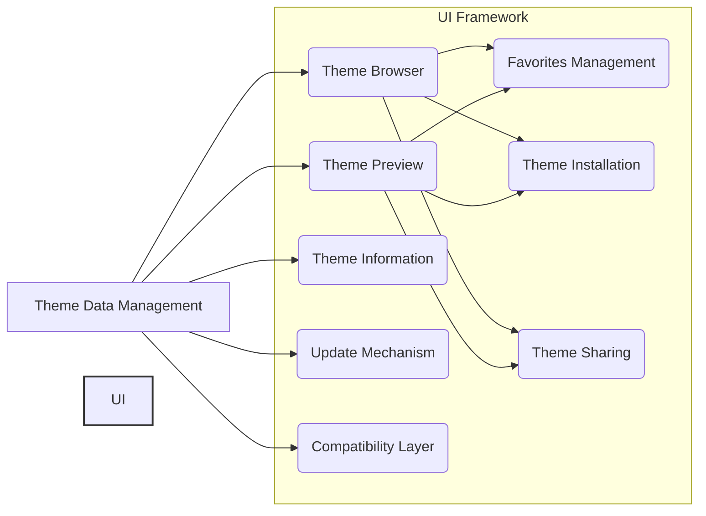

# High-Level Architectural Plan for vsskin Web App (React + IBM Carbon Design System)

This plan outlines the key architectural components and their interactions for the vsskin web app. The app will be built using React and leverage the IBM Carbon Design System for its UI components.

## I. Core Components

- **Theme Data Management:** This component will handle fetching, storing, and managing theme data. It will likely interact with a backend API (if one is planned) or a local JSON file for storing theme information. This component will be responsible for providing data to other components.

- **Theme Browser:** This component will display the available themes using Carbon's \`DataTable\`, \`Tile\`, and \`Pagination\` components. It will receive theme data from the Theme Data Management component.

- **Theme Preview:** This component will display a real-time preview of selected themes using Carbon's \`Modal\`, \`Tabs\`, and \`CodeSnippet\` components. It will receive theme data from the Theme Data Management component.

- **Theme Installation:** This component will handle the installation process, likely involving communication with VS Code extensions or a local configuration file. It will use Carbon's \`Button\` and \`Notification\` components for user feedback.

- **Favorites Management:** This component will allow users to save and manage their favorite themes using Carbon's \`Checkbox\`, \`Button\`, and \`List\` components. It will persist user preferences using local storage or a backend API.

- **Theme Sharing:** This component will facilitate sharing themes with other developers, potentially using a sharing service or a direct download mechanism. It will use Carbon's \`Button\`, \`Share\`, and \`Notification\` components.

- **Theme Information:** This component will provide detailed information about each theme, using Carbon's \`Accordion\`, \`Tooltip\`, and \`Tag\` components. It will receive theme data from the Theme Data Management component.

- **User Interface (UI) Framework:** The entire application will be built using React and the IBM Carbon Design System React components. This will ensure consistency and ease of development. Carbon's \`Header\`, \`SideNav\`, \`Breadcrumb\`, and \`Footer\` components will be used for navigation and layout.

- **Update Mechanism:** This component will handle checking for and applying updates to the app and themes. It will use Carbon's \`Notification\` and \`ProgressIndicator\` components for feedback.

- **Compatibility Layer:** This component will handle compatibility checks with different VS Code versions, using Carbon's \`Notification\` and \`Tooltip\` components for alerts and information.

## II. Data Flow

The Theme Data Management component acts as the central hub, providing data to the Theme Browser, Theme Preview, and Theme Information components. User interactions in these components will trigger updates in the Theme Data Management component, which will then propagate changes to other components as needed.

## III. Technology Stack

- **Frontend:** React, IBM Carbon Design System React components
- **State Management:** Redux or Context API (to be determined based on project complexity)
- **Backend (Optional):** Node.js, Express.js, or a similar framework (if required for theme storage and sharing)

## IV. Mermaid Diagram (Simplified)

This high-level plan provides a solid foundation for building the vsskin web app. The next steps would involve more detailed design and implementation planning for each component.
